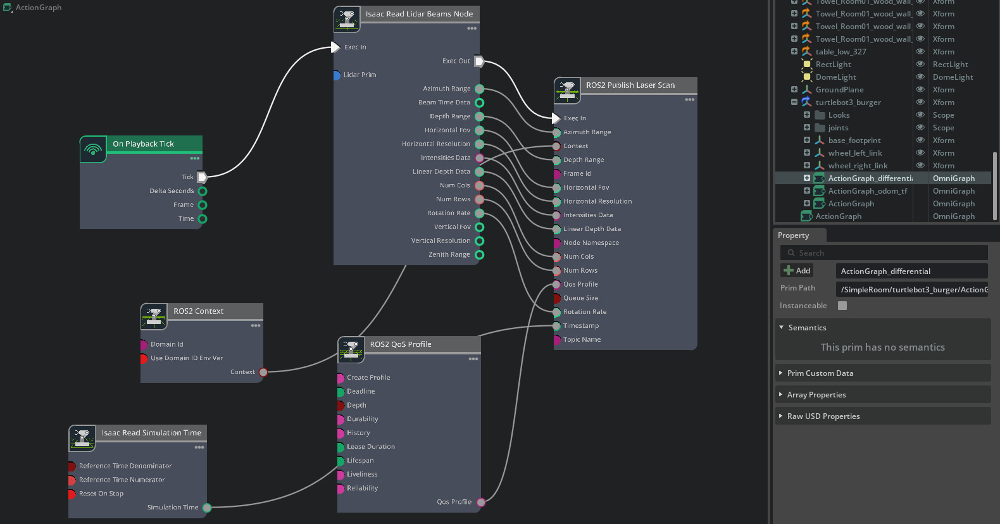
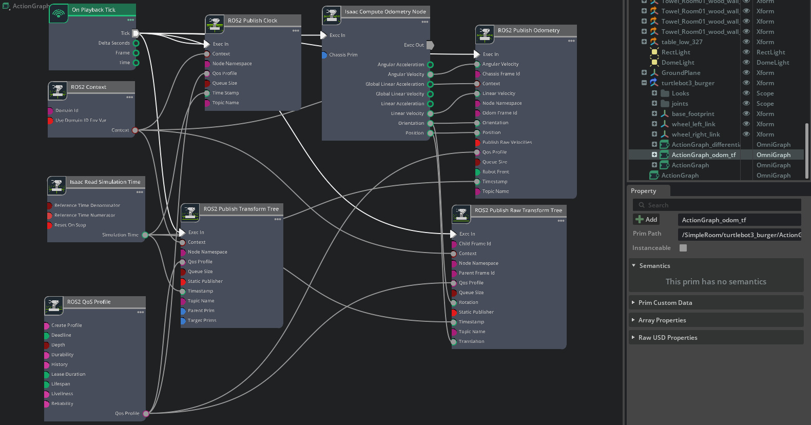

# AMR Robot (TurtleBot3) — Isaac Sim / ROS 2

This repository demonstrates an Autonomous Mobile Robot (AMR) built with **TurtleBot3** and controlled via **ROS 2** inside NVIDIA Isaac Sim. The robot can be teleoperated or run with autonomous stacks and demonstrates odometry, transform publishing, and differential drive control using Isaac ActionGraphs.

---

## 🎥 Demo Video
Click the image below to watch the AMR demo video:

---

## 📸 Action Graphs
Below are the ActionGraph visualizations used in the Isaac Sim scene.

### 1. Action Graph

**Description**  
This graph implements differential-drive kinematics by processing subscribed `/cmd_vel` twist messages, converting linear and angular velocities into wheel-specific commands, and driving the TurtleBot3 motion through the Isaac Sim Articulation Controller with proper scaling and motion constraints.

---

### 2. Differential Controller Graph

**Description**  
This graph implements differential-drive kinematics by processing subscribed `/cmd_vel` twist messages, converting linear and angular velocities into wheel-specific commands, and driving the TurtleBot3 motion through the Isaac Sim Articulation Controller with proper scaling and motion constraints.

---

### 3. Odometry & TF Publish Graph

**Description**  
This ActionGraph computes robot odometry using Isaac’s chassis state and publishes the `/odom` and `/tf` frames via the ROS 2 bridge. It ensures accurate and continuous transform broadcasting essential for navigation, mapping, and RViz visualization.

---

## 🔧 Tools & Technologies
- NVIDIA Isaac Sim  
- ROS 2 (Humble / your target distro)  
- TurtleBot3 model (as AMR)  
- Isaac ActionGraph nodes for ROS2 publishing/subscribing, odometry, and controllers  
- Teleop (ROS2 teleop twist publisher) for manual control

---

If you need help packaging the ActionGraphs or creating ROS2 launch files for Isaac Sim integration, reach out and I can help prepare step-by-step instructions or example launch files.

