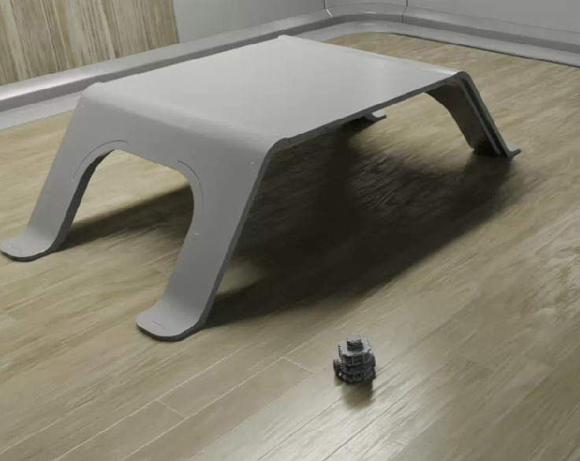
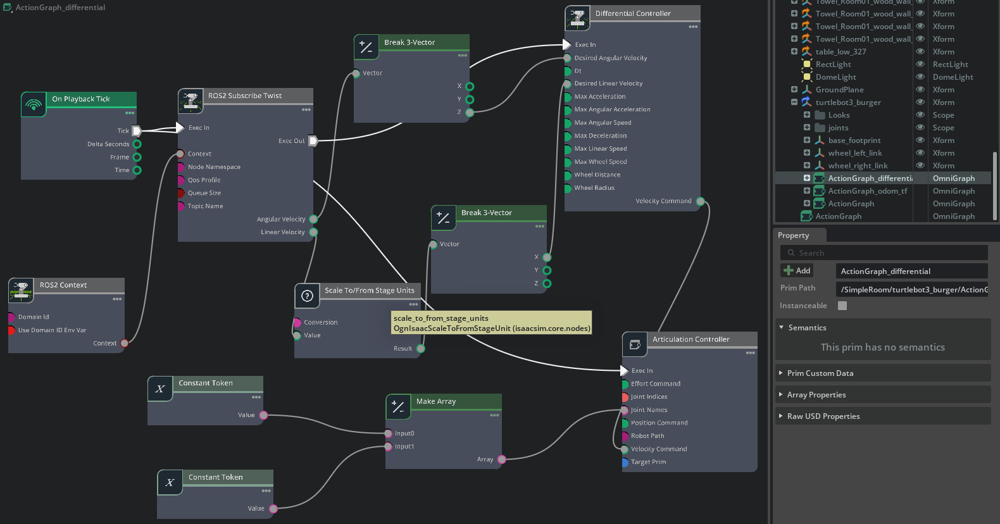

# AMR Robot (TurtleBot3) — Isaac Sim / ROS 2

This repository demonstrates an Autonomous Mobile Robot (AMR) built with **TurtleBot3** and controlled via **ROS 2** inside NVIDIA Isaac Sim. The robot can be teleoperated or run with autonomous stacks and demonstrates odometry, transform publishing and differential drive control using Isaac ActionGraphs.

---

## 🎥 Demo Video
Click the image below to watch the AMR demo video:

---

## 📸 Action Graphs
Below are the ActionGraph visualizations used in the Isaac Sim scene.

### Differential Controller Graph

**Description**  
This graph implements differential-drive kinematics by processing subscribed `/cmd_vel` twist messages, converting linear and angular velocities into wheel-specific commands and driving the TurtleBot3 motion through the Isaac Sim Articulation Controller with proper scaling and motion constraints.

---

## 🔧 Tools & Technologies
- NVIDIA Isaac Sim  
- ROS 2 (Humble)  
- TurtleBot3 model (as AMR)  
- Isaac ActionGraph nodes s  
- Teleop (ROS2 teleop twist publisher) for manual control

---

